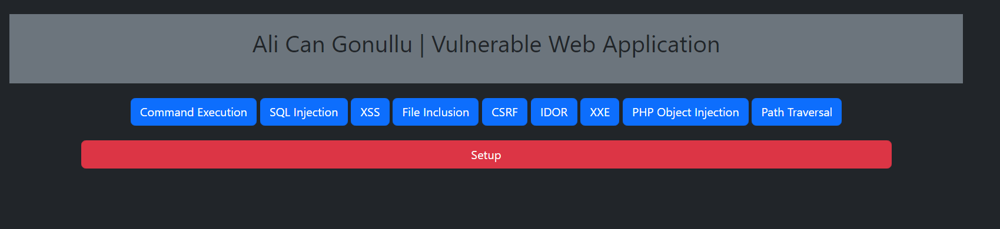

# VulnCenter-Lab

<h2>Web Vulnerabilities Labs</h2>

<h2>Installation</h2>
<ul>
<li>Install any HTTP Server program and SQL Server program (preferably XAMPP or LAMPP)</li>
<li>Copy files to inside of http root folder</li>
<li>Connect to <a href="http://localhost">localhost</a> on web browser</li>
<li>Click to "Setup" button and Setting up all SQL configuration (not use SQL password. That's a lab :) )</li>
<li>You are ready for all!</li>
</ul>
<b>Btw, you can add your vulnerable codes in this repository. I will check and accept all of them (exclude webshells or like this :P )</b>
